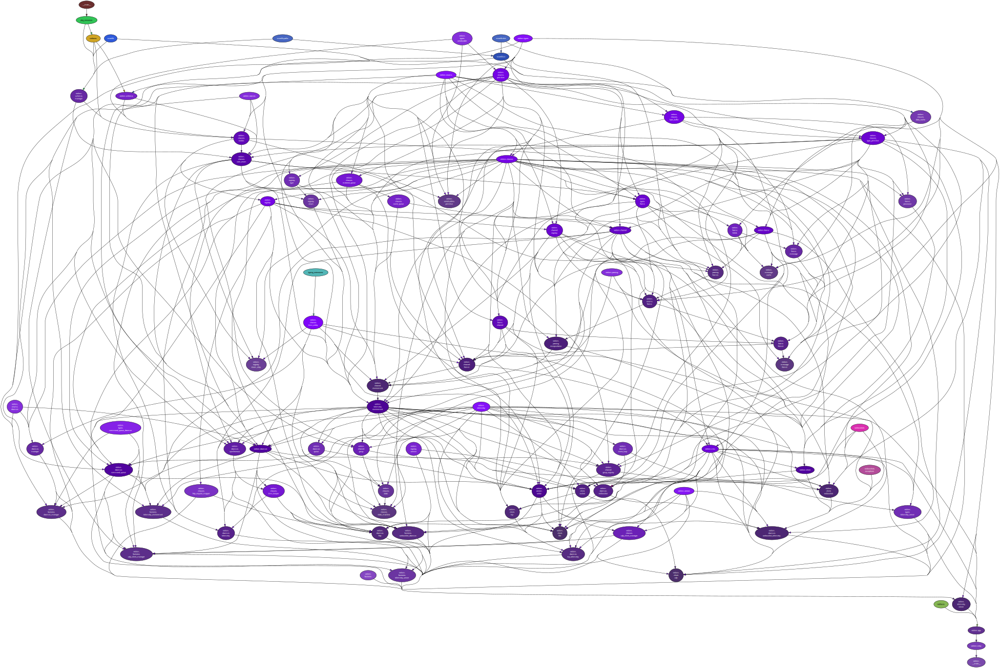

<!--
    =====================================
    generator=datazen
    version=3.0.7
    hash=d5ae09dbecd39213a5afd296063cd7ed
    =====================================
-->

# vtelem ([0.3.5](https://pypi.org/project/vtelem/))

[](https://pypi.org/project/vtelem/)

[](https://codecov.io/github/vkottler/vtelem)


*A real-time telemetry library.*

See also: [generated documentation](https://vkottler.github.io/python/pydoc/vtelem.html)
(created with [`pydoc`](https://docs.python.org/3/library/pydoc.html)).

## Python Version Support

This package is tested with the following Python minor versions:

* [`python3.7`](https://docs.python.org/3.7/)
* [`python3.8`](https://docs.python.org/3.8/)
* [`python3.9`](https://docs.python.org/3.9/)
* [`python3.10`](https://docs.python.org/3.10/)

## Platform Support

This package is tested on the following platforms:

* `windows-latest`
* `ubuntu-latest`

# Introduction

# Command-line Options

```
$ cmd.exe /c .\venv3.9\Scripts\vtelem -h

usage: vtelem [-h] [--version] [-v] [-C DIR]
              [-i {{6E74AEA3-8D99-4955-B2AE-D52CA54F4ABF},{522FD26D-2431-4C82-BFF9-97E7D48BA8CE},{483D1471-68A6-4EC4-A7E2-4CE5FBD1F70C},{FC153DFF-9914-4417-A930-379E95FCF5F3},{7D08370D-DEA7-4ED2-8E67-F45AD923B00F},{E0EC89D8-2A3A-11EB-BA6E-806E6F6E6963}}]
              [-p PORT] [--ws-cmd-port WS_CMD_PORT] [--ws-tlm-port WS_TLM_PORT] [--tcp-tlm-port TCP_TLM_PORT] [-t TICK] [--telem-rate TELEM_RATE] [--metrics-rate METRICS_RATE] [--time-scale TIME_SCALE] [-a APP_ID] [-u UPTIME]

A real-time telemetry library.

optional arguments:
  -h, --help            show this help message and exit
  --version             show program's version number and exit
  -v, --verbose         set to increase logging verbosity
  -C DIR, --dir DIR     execute from a specific directory
  -i {{6E74AEA3-8D99-4955-B2AE-D52CA54F4ABF},{522FD26D-2431-4C82-BFF9-97E7D48BA8CE},{483D1471-68A6-4EC4-A7E2-4CE5FBD1F70C},{FC153DFF-9914-4417-A930-379E95FCF5F3},{7D08370D-DEA7-4ED2-8E67-F45AD923B00F},{E0EC89D8-2A3A-11EB-BA6E-806E6F6E6963}}, --interface {{6E74AEA3-8D99-4955-B2AE-D52CA54F4ABF},{522FD26D-2431-4C82-BFF9-97E7D48BA8CE},{483D1471-68A6-4EC4-A7E2-4CE5FBD1F70C},{FC153DFF-9914-4417-A930-379E95FCF5F3},{7D08370D-DEA7-4ED2-8E67-F45AD923B00F},{E0EC89D8-2A3A-11EB-BA6E-806E6F6E6963}}
                        interface to bind to
  -p PORT, --port PORT  http api port
  --ws-cmd-port WS_CMD_PORT
                        websocket command-interface port
  --ws-tlm-port WS_TLM_PORT
                        websocket telemetry-interface port
  --tcp-tlm-port TCP_TLM_PORT
                        tcp telemetry-interface port
  -t TICK, --tick TICK  lenth of a time tick
  --telem-rate TELEM_RATE
                        rate of the telemetry-servicing loop
  --metrics-rate METRICS_RATE
                        default rate of internal metrics data
  --time-scale TIME_SCALE
                        scalar to apply to the progression of time
  -a APP_ID, --app-id APP_ID
                        a value that forms the basis for the application identifier
  -u UPTIME, --uptime UPTIME
                        specify a finite duration to run the server

```

# Documentation

Project documentation can be found in
[Markdown](https://www.markdownguide.org/) files in the [`docs/`](docs)
directory.

* [Primitive Types](docs/primitive.md)
* [Frame Types](docs/message.md)
* [Message Types](docs/message_type.md)
* [Channel Identifiers](docs/channel_identifier.md)
* [Serializable Data Structures](docs/serializable.md)

# Internal Dependency Graph

A coarse view of the internal structure and scale of
`vtelem`'s source.
Generated using [pydeps](https://github.com/thebjorn/pydeps) (via
`mk python-deps`).


