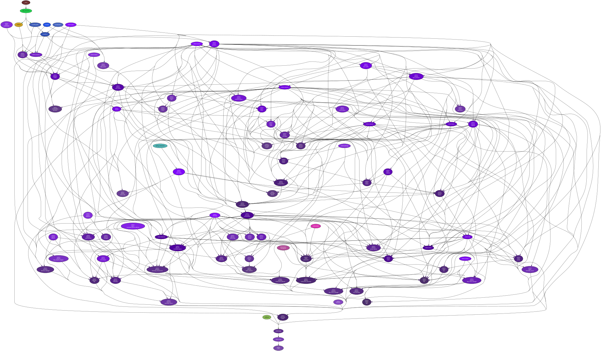

<!--
    =====================================
    generator=datazen
    version=3.0.0
    hash=b7bc281c82e5ab7decd8c5359c138160
    =====================================
-->

# vtelem ([0.3.5](https://pypi.org/project/vtelem/))

[](https://pypi.org/project/vtelem/)

[](https://codecov.io/github/vkottler/vtelem)

*A real-time telemetry library.*

# Command-line Options

```
$ ./venv3.8/bin/vtelem -h

usage: vtelem [-h] [--version] [-v] [-C DIR] [-i {lo,enp0s25,wlo1}] [-p PORT]
              [--ws-cmd-port WS_CMD_PORT] [--ws-tlm-port WS_TLM_PORT]
              [--tcp-tlm-port TCP_TLM_PORT] [-t TICK]
              [--telem-rate TELEM_RATE] [--metrics-rate METRICS_RATE]
              [--time-scale TIME_SCALE] [-a APP_ID] [-u UPTIME]

A real-time telemetry library.

optional arguments:
  -h, --help            show this help message and exit
  --version             show program's version number and exit
  -v, --verbose         set to increase logging verbosity
  -C DIR, --dir DIR     execute from a specific directory
  -i {lo,enp0s25,wlo1}, --interface {lo,enp0s25,wlo1}
                        interface to bind to
  -p PORT, --port PORT  http api port
  --ws-cmd-port WS_CMD_PORT
                        websocket command-interface port
  --ws-tlm-port WS_TLM_PORT
                        websocket telemetry-interface port
  --tcp-tlm-port TCP_TLM_PORT
                        tcp telemetry-interface port
  -t TICK, --tick TICK  lenth of a time tick
  --telem-rate TELEM_RATE
                        rate of the telemetry-servicing loop
  --metrics-rate METRICS_RATE
                        default rate of internal metrics data
  --time-scale TIME_SCALE
                        scalar to apply to the progression of time
  -a APP_ID, --app-id APP_ID
                        a value that forms the basis for the application
                        identifier
  -u UPTIME, --uptime UPTIME
                        specify a finite duration to run the server

```

# Documentation

Project documentation can be found in
[Markdown](https://www.markdownguide.org/) files in the [`docs/`](docs)
directory.

* [Primitive Types](docs/primitive.md)
* [Frame Types](docs/message.md)
* [Message Types](docs/message_type.md)
* [Channel Identifiers](docs/channel_identifier.md)
* [Serializable Data Structures](docs/serializable.md)

# Internal Dependency Graph

A coarse view of the internal structure and scale of
`vtelem`'s source.
Generated using [pydeps](https://github.com/thebjorn/pydeps) (via
`mk python-deps`).


